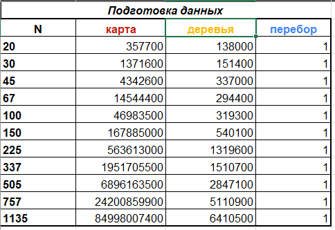
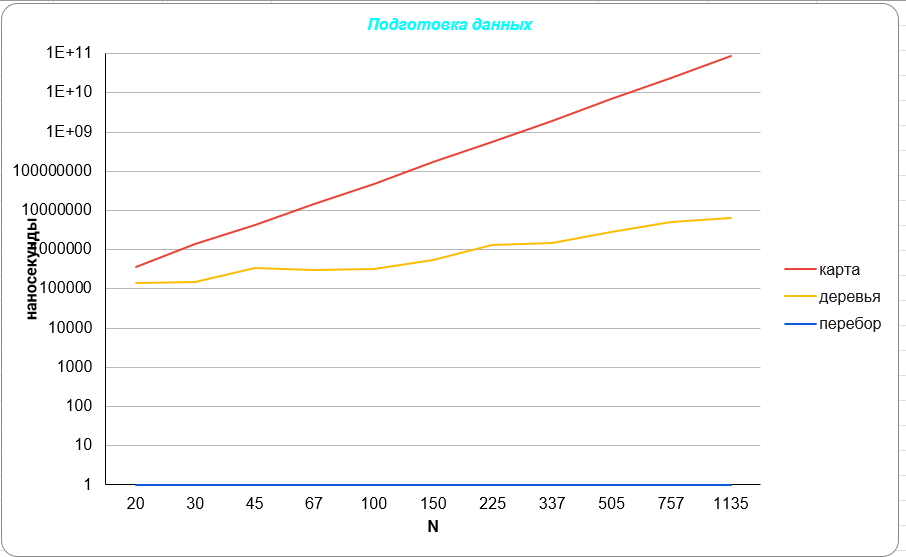
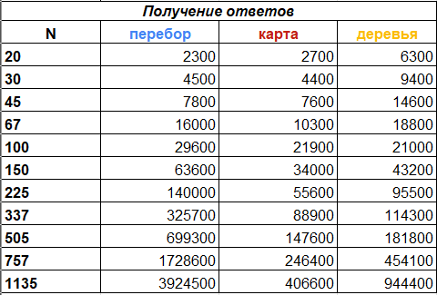
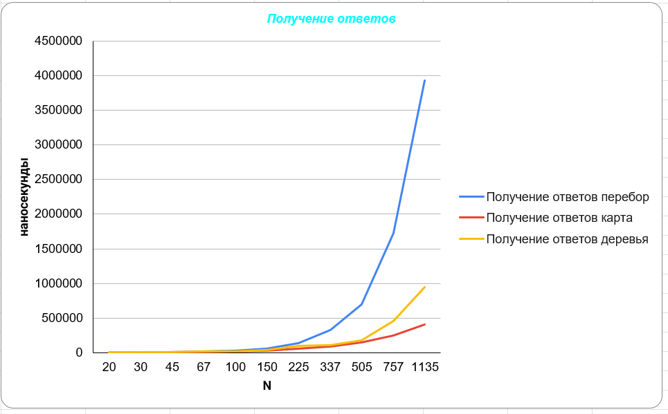

# Лабораторная работа №2

## Реализация 3 алгоритмов по поиску количества вложенных прямоугольников в заданной точке на координатной плоскости.

---

#### Третья реализация отправлялась с аккаунта с логином: makhodyrev@edu.hse.ru (id 113116928).
#### Все сырые данные и графики находятся в папке artefacts, реализации всех алгоритмов в папке lab2.
---
### Таблица и график с замерами времени подготовки данных:

---
### Вывод: 
#### График "подготовки данных" для обычного перебора практически незаметен, так как этот алгоритм не требует предварительной подготовки данных. Эффективность такого алгоритма можно представить горизонтальной линией (y=1) на графике, что соответствует сложности О(1). Когда количество прямоугольников увеличивается, время, необходимое для построения карты, значительно возрастает, и, как правило, требует много времени, так как сложность равна О(N^3). С другой стороны, подготовка данных для деревьев выполняется гораздо быстрее и требует сравнительно небольшого времени, при этом его время выполнения увеличивается логарифмически, что соответствует сложности О(N*log(N)).
#### Итак, можно сделать выводы: для небольших данных для простоты используется исчерпывающий алгоритм, который не требует предварительной подготовки данных. Однако, когда данные становятся большими, особенно при очень большом количестве прямоугольников, предпочтительнее использовать деревья, так как они обрабатываются быстрее и их время выполнения увеличивается логарифмически.
---
### Таблица и график с замерами времени на получение ответа:

---
### Вывод: 
#### Когда число прямоугольников увеличивается, время, необходимое для получения результата с использованием переборного алгоритма, значительно быстрее увеличивается по сравнению с временем вычисления, необходимым для алгоритма карты или алгоритма деревьев. Это связано с тем, что сложность переборного алгоритма составляет O(N), в то время как для двух других она составляет O(log(N)). Однако эти алгоритмы различаются по константному множителю: у алгоритма на деревьях он больше из-за необходимости сжатия координат и спуска по дереву, в то время как у алгоритма на карте он меньше, поскольку требуется только сжатие координат и обращение к элементу матрицы.
#### Исходя из этого, можно сделать некоторые выводы: при большом количестве прямоугольников предпочтительнее избегать использования переборного алгоритма. Алгоритм на карте предоставляет ответы быстрее всех, но требует значительного времени на подготовку, поэтому его использование лучше всего подходит для ситуаций с малым количеством прямоугольников или большим количеством точек.

---
### Общий вывод:
#### В общих чертах вывод следующий: Если количество прямоугольников и точек невелико (до примерно 2000), переборный алгоритм будет наилучшим выбором, так как он не требует дополнительных затрат времени и памяти на подготовку, и при таких параметрах сможет быстро вернуть ответ.
#### Во всех других случаях наиболее эффективным будет алгоритм на деревьях, поскольку процесс подготовки занимает относительно небольшое время, а скорость возврата ответа высока. Однако, если количество точек значительно превосходит количество прямоугольников (особенно если прямоугольников немного), а нам критически важна скорость получения ответов или мы готовы потратить больше времени на подготовку для достижения более быстрого возврата ответов, то в таком случае наиболее подходящим будет алгоритм на карте.
